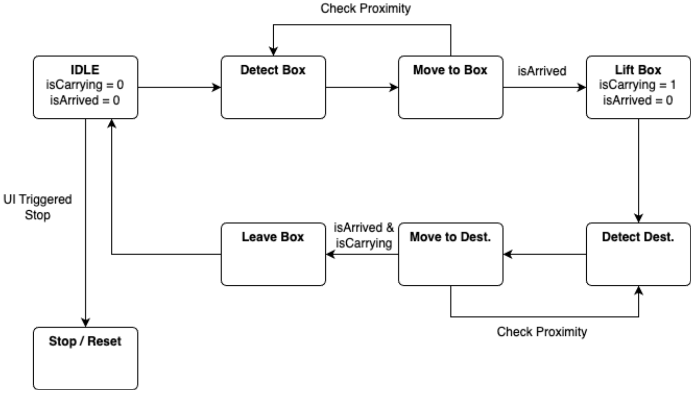

### Before running machine

`$ cd ui && yarn && yarn build && cd ..`

`$ cd server && yarn && yarn start`

### Running sim machine

`$ python run_sim.py`

### Running real machine

`$ python run_phys.py`
